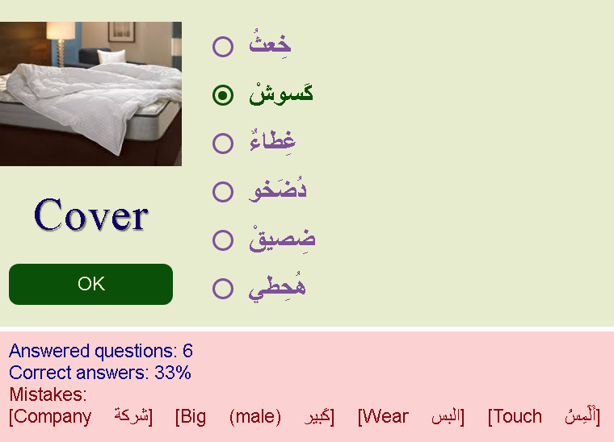
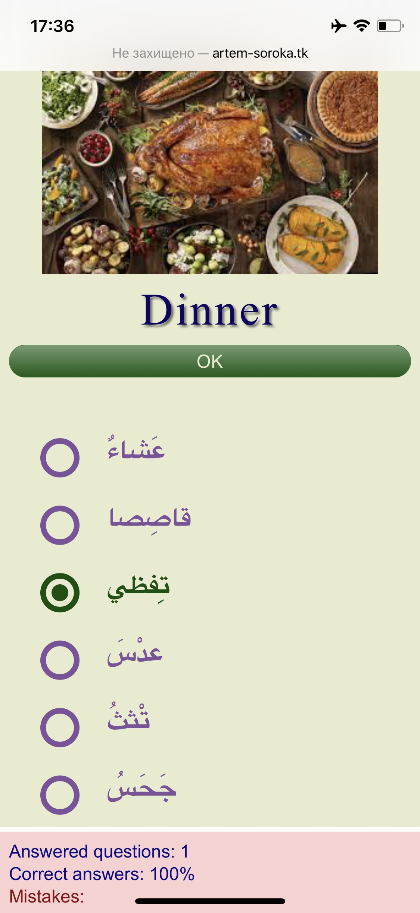

# Arabic test for Year 2

After creating [first version](https://github.com/nevtemu/arabic-test-year1 "Arabic test for Year 1") of the test I realized that my children can easily solve it by eliminating answers that they know.     
This test generates wrong answers from random arabic letters. I have to mention, that female words in arabic ends with ة and verbs often starts with أ so I had to factor this in, when generating answers. Some answers consist of two words, so I took this into account as well.     
The rest of algorithm is simple. It will choose one correct word from collection, generate wrong answers of same configuration and create a list of answers from them.
       
This is example:     
   

     
I created rules to make look better on small screens as well.
      
 
                      

### Test it yourself
Live version can be found [here](http://artem-soroka.tk/pages/ara3/ "Arabic test for Year 2").   
     
Thank you.